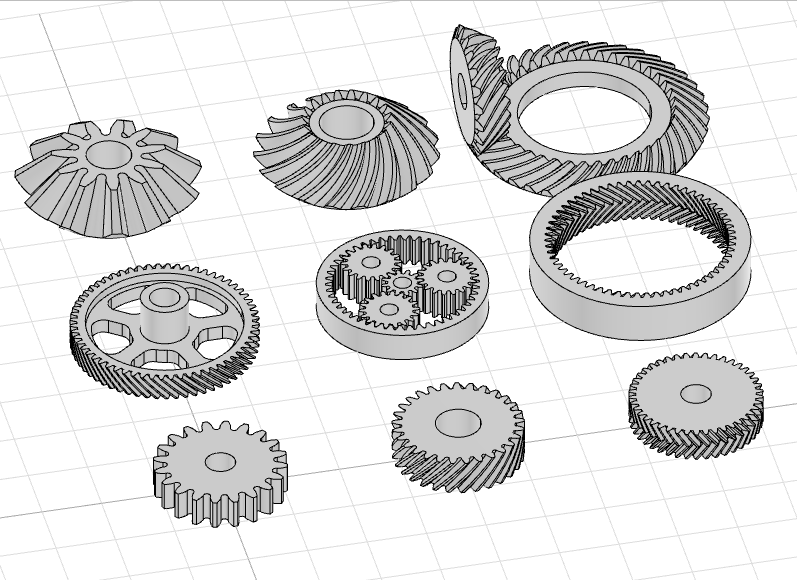
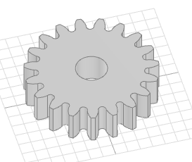
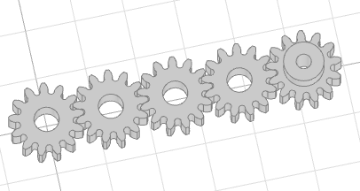
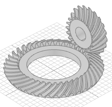
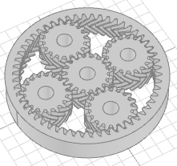
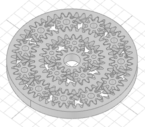
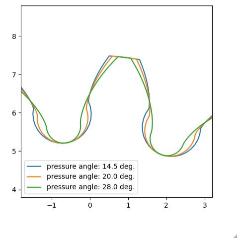
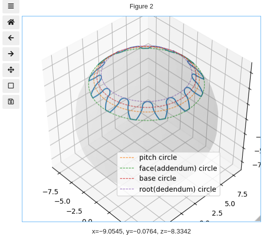
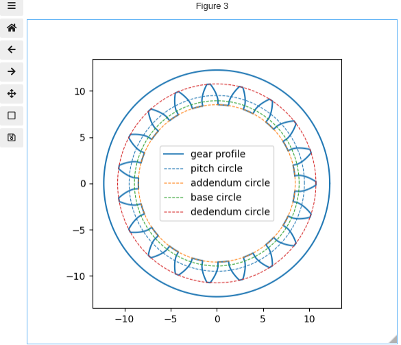

# CQ_Gears - CadQuery based involute profile gear generator
 

Work in progress...

Might be unstable, but somewhat usable.

## v0.45 
Can generate the following types of gears:
- Spur gear
- Helical gear
- Herringbone gear
- Ring gear (helical/herringbone versions too)
- Planetary gearsets
- Straight and helical bevel gears

## Installation
Assuming you already have **CadQuery** environment installed (if not, please follow instructions [here](https://github.com/CadQuery/cadquery/blob/master/README.md) first).

To install with pip:
```
    pip install git+https://github.com/meadiode/cq_gears.git@main
```

Or, alternatively, clone this repo and run setup.py as follows:
```
    python3 setup.py install
```

CQ_Gears depend on **numpy**, which should be installed automatically if you don't have it.

To see provided examples (in a form of Jupyter notebooks) you also going to need [Jupyter](https://jupyter.org/) together with [jupyter-cadquery](https://github.com/bernhard-42/jupyter-cadquery/blob/master/README.md).

Also, some example notebooks use [matplotlib]() and [matplotlib widget(ipympl)](https://github.com/matplotlib/ipympl), you might want to install them as well.


## Usage

Minimal example:
```
import cadquery as cq
from cq_gears import SpurGear

# Create a gear object with the SpurGear class
spur_gear = SpurGear(module=1.0, teeth_number=19, width=5.0, bore_d=5.0)

# Build this gear using the gear function from cq.Workplane
wp = cq.Workplane('XY').gear(spur_gear)

show(wp)
```
The result should look like this:



Note that instantiating **SpurGear** (or any other class from **cq_gears**) will not create a solid body right away. Creating object just pre-calculates some important parameters and curves that later will be used during build phase.

To actually build the solid object, you shall pass the created gear object to the **gear** or **add_gear** functions from cq.Workplane

Another example:
```
spur_gear = SpurGear(module=1.0, teeth_number=13, width=5.0, bore_d=5.0)

wp = (cq.Workplane('XY')
        # Pushing an array of 4 points with spacing equal to the gear's pitch diameter 
      .rarray(xSpacing=spur_gear.r0 * 2.0,
              ySpacing=1.0, xCount=4, yCount=1, center=False)
        # Create 4 meshing gears
      .gear(spur_gear)
      
      .moveTo(spur_gear.r0 * 2 * 4, 0.0)
        # Create an additional gear with the same profile but with different
        # bore diameter and hub
      .add_gear(spur_gear, bore_d=3.0, hub_d=8.0, hub_length=4.0))
      
show(wp)
```
The result:



Here multiple copies of a gear placed at each point on the stack.
Note that you can use the spur_gear object to reference pre-calculated dimensions such as pitch-radius.
Also note that build parameters (such as *bore_d*, *hub_d*, *hub_length* etc.) could be passed either to the SpurGear constructor, or to the gear and add_gear functions.

Check out other examples from the examples directory:







For research/educational purposes there is also a couple of noutbooks that use matplotlib to plot various gear profiles:







## Credits
This project is inspired by [Gears Library for OpenSCAD](https://www.thingiverse.com/thing:1604369) by Joerg Janssen(thingiverse@janssen86). Some of the math is also borrowed from there.
